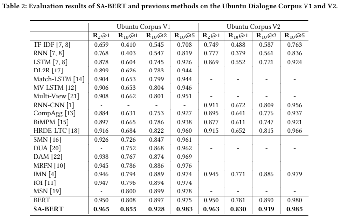
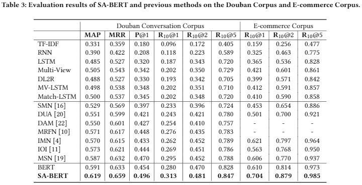

# Speaker-Aware BERT for Multi-Turn Response Selection
This repository contains the source code and pre-trained models for the CIKM 2020 paper [Speaker-Aware BERT for Multi-Turn Response Selection in Retrieval-Based Chatbots](https://arxiv.org/pdf/2004.03588.pdf) by Gu et al. <br>


## Results




## Dependencies
Python 3.6 <br>
Tensorflow 1.13.1


## Download 
- Download the [BERT released by the Google research](https://storage.googleapis.com/bert_models/2018_10_18/uncased_L-12_H-768_A-12.zip), 
  and move to path: ./uncased_L-12_H-768_A-12 <br>

- We also provide the [BERT adapted on the Ubuntu V1 dataset](https://drive.google.com/file/d/1M8V018XZbVDo4Xq96pCLFRt6yVzoKtjH/view?usp=sharing), 
  and move to path: ./uncased_L-12_H-768_A-12_adapted. You just need to fine tune it to reproduce our results. <br>
  
- Download the [Ubuntu V1 dataset](https://drive.google.com/file/d/1-rNv34hLoZr300JF3v7nuLswM7GRqeNc/view),
  and move to path: ./data/Ubuntu_V1_Xu/Ubuntu_Corpus_V1 <br>


## Adaptation
Create the adaptation data.
```
cd data/Ubuntu_V1_Xu/
python create_adaptation_data.py 
```
Running the adaptation process.
```
cd scripts/
bash adaptation.sh
```
The adapted model will be saved to the path ```./uncased_L-12_H-768_A-12_adapted```. <br> 
Modify the filenames in this folder to make it the same as those in Google's BERT. 


## Training
Create the fine-tuning data.
```
cd data/Ubuntu_V1_Xu/
python create_finetuning_data.py 
```
Running the fine-tuning process.

```
cd scripts/
bash ubuntu_train.sh
```

## Testing
Modify the variable ```restore_model_dir``` in ```ubuntu_test.sh```
```
cd scripts/
bash ubuntu_v1_test.sh
```
A "output_test.txt" file which records scores for each context-response pair will be saved to the path of ```restore_model_dir```. <br>
Modify the variable ```test_out_filename``` in ```compute_metrics.py``` and then run the following command, various metrics will be shown.
```
python compute_metrics.py
```


## Cite
If you use the source code and pre-trained models, please cite the following paper:
**"Speaker-Aware BERT for Multi-Turn Response Selection in Retrieval-Based Chatbots"**
Jia-Chen Gu, Tianda Li, Quan Liu, Zhen-Hua Ling, Zhiming Su, Si Wei, Xiaodan Zhu. _CIKM (2020)_

```
@inproceedings{Gu:2020:SABERT:3340531.3412330,
 author = {Gu, Jia-Chen and 
           Li, Tianda and
           Liu, Quan and
           Ling, Zhen-Hua and
           Su, Zhiming and 
           Wei, Si and
           Zhu, Xiaodan
           },
 title = {Speaker-Aware BERT for Multi-Turn Response Selection in Retrieval-Based Chatbots},
 booktitle = {Proceedings of the 29th ACM International Conference on Information and Knowledge Management},
 series = {CIKM '20},
 year = {2020},
 isbn = {978-1-4503-6859-9},
 location = {Virtual Event, Ireland},
 pages = {2041--2044},
 url = {http://doi.acm.org/10.1145/3340531.3412330},
 doi = {10.1145/3340531.3412330},
 acmid = {3412330},
 publisher = {ACM},
}
```


## Update
Please feel free to open issues if you have some problems.
